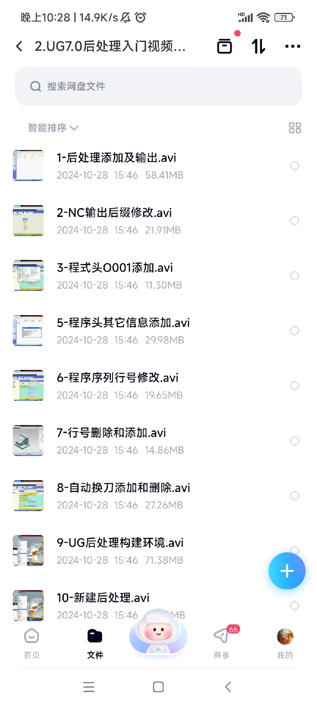
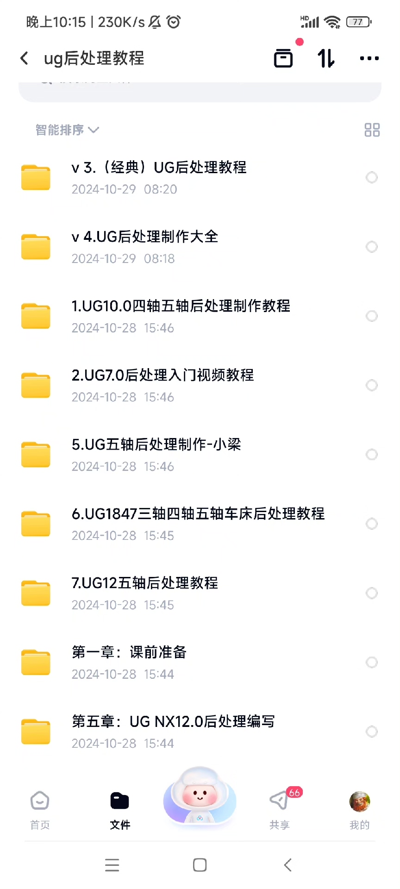
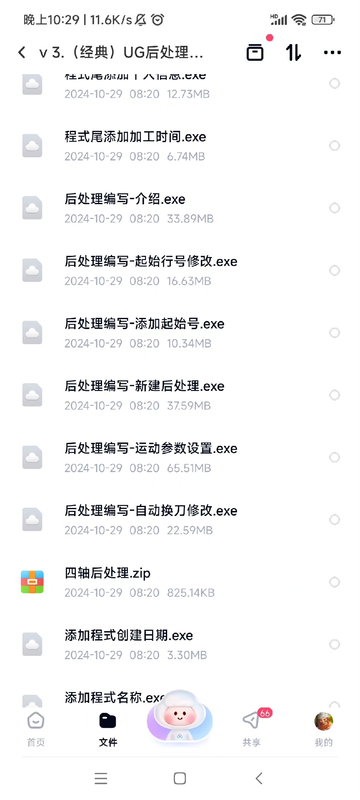
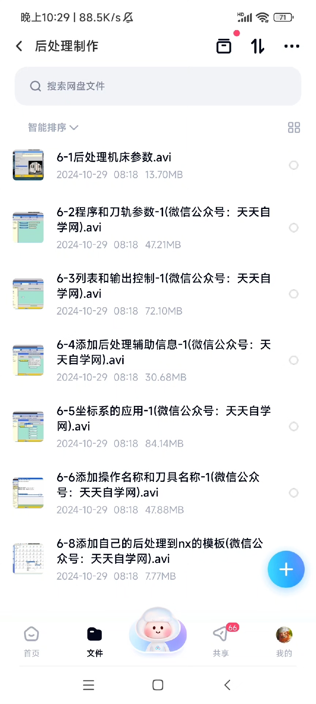
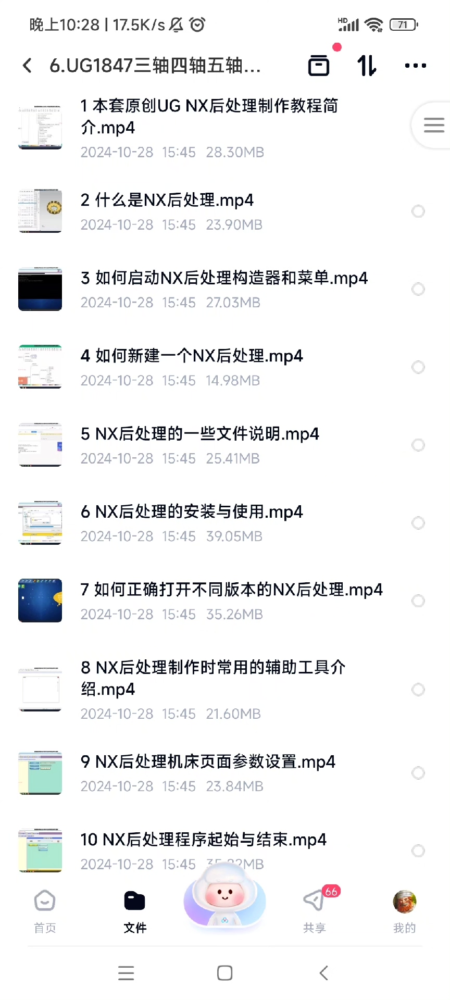
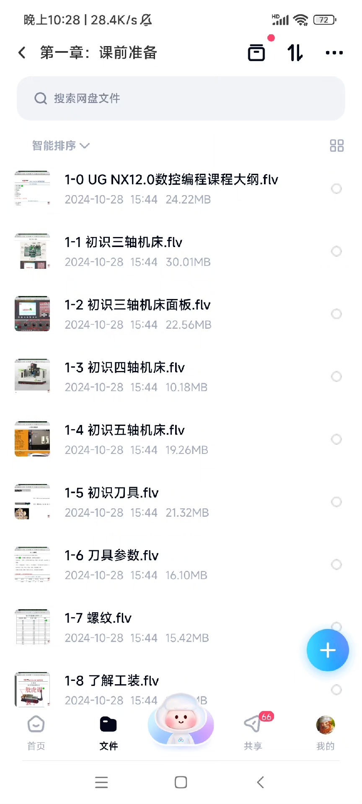
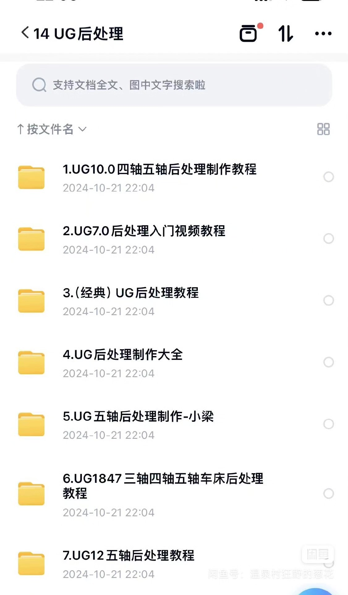

# Ug post-processing builder tutorial cnc education ug software tutorial cnc machining tutorial ca

## Body

Ug post-processing construction tutorial, CNC education UG software tutorial, CNC machining tutorial, CAM teaching course.
A complete set of video tutorials for Ug post-processing production, approximately 90G in size.

Tutorial Content: From the perspective of a beginner, this detailed guide explains the entire process from scratch to creating three-axis, four-axis, and five-axis machine tooling post-processing. It will help you effortlessly master the creation of post-processing files.

Training institution VIP video materials are available on Baidu Cloud.
Video tutorials, post-processing, and a simulation file are included.
Only tutorials are provided, without technical support! The market's lowest price.

Interested friends, click "I want" and DM me [heart][heart]
Virtual items are non-refundable once sold. Please read the order carefully!

## Images

## Payment

Here is a pay link on Stripe ( https://buy.stripe.com/3cs8yP7sY87d0vu9AB ). Please contact me lonlonago@foxmail.com after funding $89, and I will send you a complete data files , thank you!

